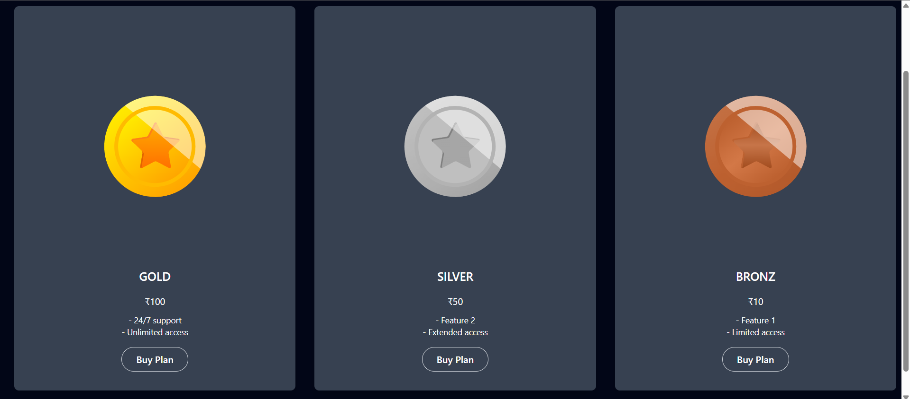

# VTube – Over the Top (OTT) Platform
*FrontendLink:* [Frontend](https://github.com/VinayBorate/V_Tube)  
*BackendLink:* [Backend](https://github.com/VinayBorate/VTube_Backend)
*ProjectDeployed Link:* [VTube](https://vtubebyvinay.netlify.app/) 
## 📌 Project Description
VTube is a full-stack OTT (Over the Top) platform that enables users to browse, upload, and interact with videos based on their subscription plans. The platform is built using **React** for the frontend, **Node.js** and **Express** for the backend, and **MongoDB** for database management, ensuring a seamless and scalable video streaming experience.

### 🔹 Key Integrations:
- **Cloudinary** for cloud-based video storage.
- **Razorpay** for secure payment processing and subscription management (Gold, Silver, Bronze plans).
- **JWT & Bcrypt** for authentication and authorization.
- **OTP verification** for secure account access.
- **NodeMailer** for email notifications, including OTP verification, account updates, and transactional emails.

## 🚀 Key Features
✅ **User Authentication & Authorization** (JWT, Bcrypt, OTP verification)  
✅ **Secure Subscription-Based Access** with Razorpay payment integration  
✅ **Cloud-Based Video Storage** using Cloudinary  
✅ **Video Uploading, Browsing & Interaction** (Likes & Comments)  
✅ **Email Notifications** via NodeMailer (OTP verification & account updates)  
✅ **Role-Based Access Control** for secure content management  
✅ **MVC Architecture** for scalability and maintainability  

---

## 🛠 Tech Stack

### 🎨 Frontend:
[](https://reactjs.org/)
[](https://tailwindcss.com/)

### 🏗 Backend:
[](https://nodejs.org/)
[](https://expressjs.com/)

### 🗄 Database:
[](https://www.mongodb.com/)

### ☁ Cloud Storage:
[](https://cloudinary.com/)

### 💳 Payment Integration:
[](https://razorpay.com/)

### 🔑 Authentication & Security:
[](https://jwt.io/)
[](https://www.npmjs.com/package/bcrypt)

---

## 📜 Installation & Setup
### Prerequisites:
- **Node.js** installed
- **MongoDB** setup (local or cloud-based)
- **Razorpay Account** for payment gateway
- **Cloudinary Account** for video storage

## Frontend Setup

1. Clone the repository:
   ```sh
   git clone https://github.com/VinayBorate/V_Tube.git
   ```
2. Navigate into the project folder:
   ```sh
   cd V_Tube
   ```
3. Install dependencies:
   ```sh
   npm install
   ```
4. Create a `.env` file in the frontend directory and set the backend URL:
   ```sh
   VITE_BASE_URL=http://localhost:3000
   ```
5. Start the frontend development server:
   ```sh
   npm run dev
   ```

---

## Backend Setup

1. Clone the repository:
   ```sh
   git clone https://github.com/VinayBorate/VTube_Backend.git
   ```
2. Navigate into the backend folder:
   ```sh
   cd VTube_Backend
   ```
3. Install dependencies:
   ```sh
   npm install
   ```
4. Create a `.env` file in the backend directory and set up the required environment variables:
   ```sh
   PORT=3000
   DATABASE_URL=mongodb://localhost:27017/VtubeBackend

   MAIL_HOST=smtp.gmail.com
   MAIL_USER=vinaybbbb@gmail.com
   MAIL_PASS=

   JWT_SECRET=borate

   # Cloudinary Configuration
   CLOUD_NAME=
   CLOUD_API_KEY=
   CLOUD_API_SECRET=
   CLOUD_FOLDER=

   # Razorpay Configuration
   RAZORPAY_KEY_ID=
   RAZORPAY_KEY_SECRET=
   ```
5. Start the backend development server:
   ```sh
   npm run dev
   ```


---

## Demo & Screenshots
  
- **Login Page** 
 

- **Signup Page** 
  

- **OTP Page**


- **Home Page**


- **Dashboard Page**


- **Plans Page**



---

## 🎯 Contributing
Contributions are welcome! Feel free to open issues or submit pull requests to improve the platform.

---

## 📧 Contact
For any queries or suggestions, feel free to reach out:
- **Email:** vinayborate121@gmail.com
- **GitHub:** [yourusername](https://github.com/VinayBorate)
- **Linkedin:** [VinayBorate](https://www.linkedin.com/in/vinayborate/)
